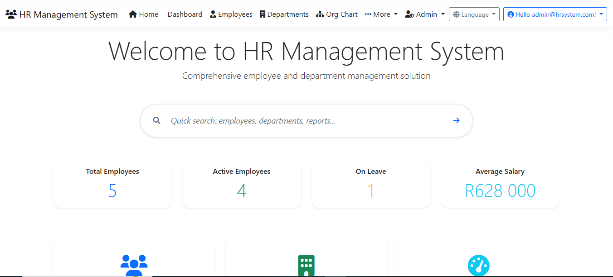

# HR Management System (Razor Pages, .NET 8)

Live demo
- Production (Render): https://hr-management-system-jstj.onrender.com/
- Hangfire dashboard: https://hr-management-system-jstj.onrender.com/hangfire

Overview
A complete HR Management System built with .NET 8 and Razor Pages. It uses SQLite for app and identity data (demo-friendly, ephemeral on Render free tier), ASP.NET Core Identity for authentication/authorization, Hangfire for background jobs, and QuestPDF for PDF exports. The UI focuses on a clean employee experience with powerful admin features.

Highlights
- Employees: CRUD, profile photo upload, salary, department, manager, employment type, soft delete (recycle bin)
- Departments: management and analytics
- Line managers: self-referencing relationships and Org Chart
- Dates: birthdays and work anniversaries (with Today/Tomorrow badges)
- Exports: Excel, CSV, and PDF (QuestPDF)
- Status change requests with approval flow and audit trail
- Background jobs (Hangfire): birthdays, anniversaries, reports
- Localization: en-ZA (default) and en-US with culture cookie endpoint
- API layer for employees + Swagger in Development

Tech stack
- .NET 8, Razor Pages
- EF Core (SQLite), Identity
- Hangfire (InMemory for demo)
- QuestPDF, ClosedXML, X.PagedList

Screenshots
The repository includes a screenshots folder, and all images are now checked in under `HRManagementSystem/docs/screenshots/`.

- Home
  
- Employees list
  
- Employee profile
  
- Dashboard
  
- Departments
  
- Department analytics
  
- Login
  
- Org Chart
  
- Admin view
  
- Audit log
  

Demo credentials
- Email: admin@hrsystem.com
- Password: Admin@123

Run locally
1) Prerequisites: .NET 8 SDK
2) From `HRManagementSystem` project folder:
   - dotnet restore
   - dotnet run
3) First run creates SQLite databases and seeds demo data and roles.

Deployment (Render)
- Live demo: https://hr-management-system-jstj.onrender.com/
- Dockerfile exposes port 8080 and binds `ASPNETCORE_URLS=http://+:8080`.
- On the free plan, SQLite files are ephemeral; data resets on redeploy/restart. Hangfire jobs/history are in-memory.

Notes and limitations
- Free-tier persistence: use an external DB or Render Disk (paid) for durable data.
- Hangfire dashboard is open in demo; lock it down with `HangfireAuthorizationFilter` for production.
- DataProtection keys are stored in-container in demo (warnings in logs are expected on free tier).

Project structure (selected)
- Models: `Employee`, `Department`, `StatusChangeRequest`, view models
- Data: `AppDbContext`, `ApplicationDbContext`, `DemoDataSeeder`
- Services: background jobs (`IBackgroundJobTasks`), audit service
- UI: Razor Pages and views, charts, column chooser, paging
- API: Employees API + Swagger (Development)

License
Community/demo usage. Adapt as needed.

